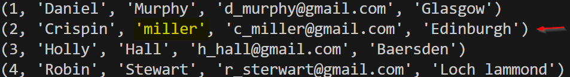
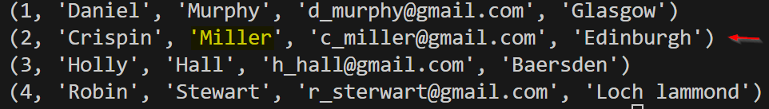

# Notes

## setup repo

### …or create a new repository on the command line

```bash
echo "# Sqlite_DB_python" >> README.md
git init
git add README.md
git commit -m "first commit"
git branch -M main
git remote add origin https://github.com/shahnawazkcl/Sqlite_DB_python.git
git push -u origin main
```

### **…or push an existing repository from the command line**

```bash
git remote add origin https://github.com/shahnawazkcl/Sqlite_DB_python.git
git branch -M main
git push -u origin main
```

## Data types in SQL

- NULL
- INTEGER
- REAL
- TEXT
- BLOB: images, vidioes etc

## queying

- **fetch**: fetchone or fetchall/many gives us a list which can be indexed using `list[0]` etc.
- **update**: update records using row id `sqlite/query_database_01.py` section 03.
 updated record 
- **delete**: delete/drop records  using row id `sqlite/query_database_01.py` section 04.

## Buiding and App

We are now going to build an app called `thisApp` to shaow most of the functionalities of `sqlite database`.
**STEPS:**

- S1: use the same `/sqlite/database_many.py` and modify using functions.
- S1.1: created `thisApp_db_initial.py` to initialize the database name `thisApp.db` with table name `users`.

### Refrences

- [sqlite database doumentations.](https://www.sqlite.org/index.html)
- [python sqlite3 docs](https://docs.python.org/3/library/sqlite3.html)
